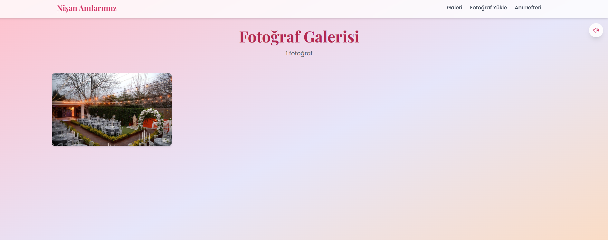
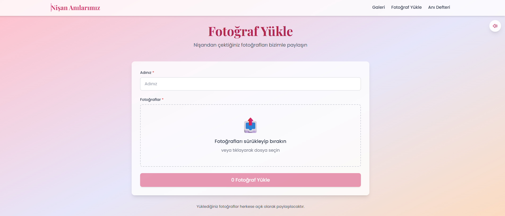
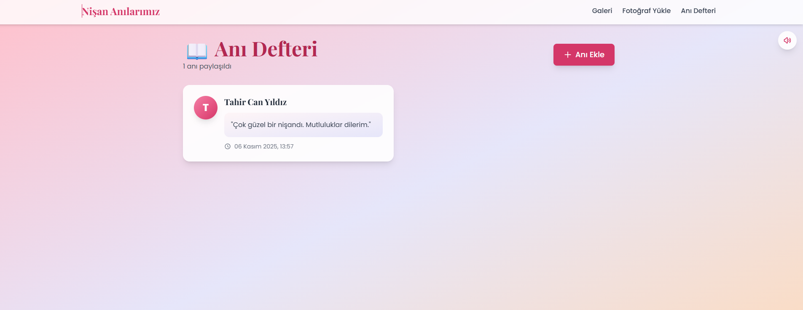
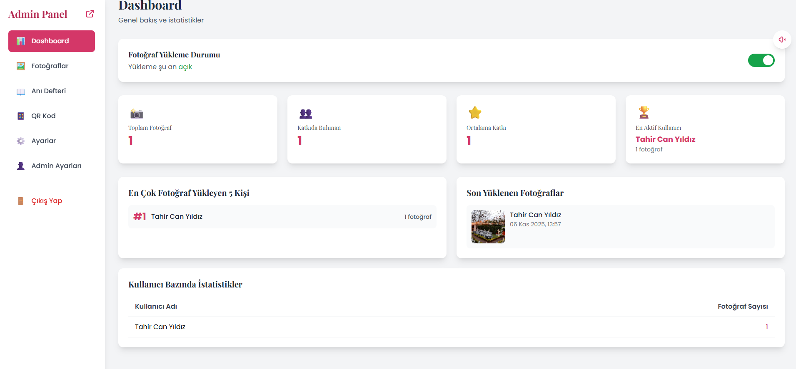
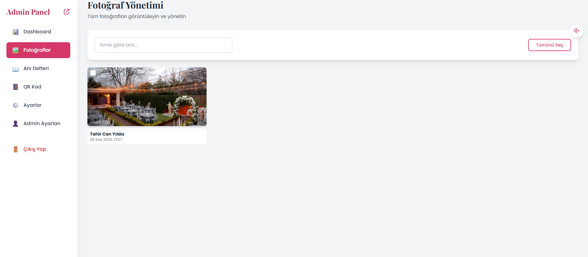
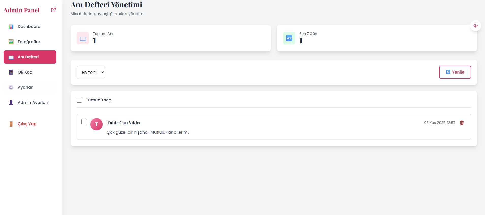
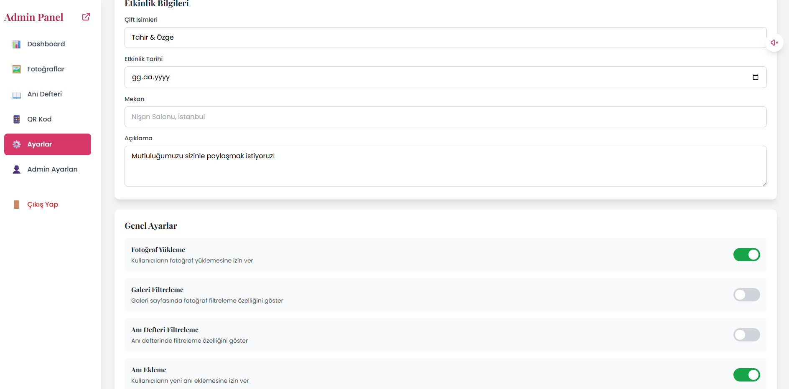
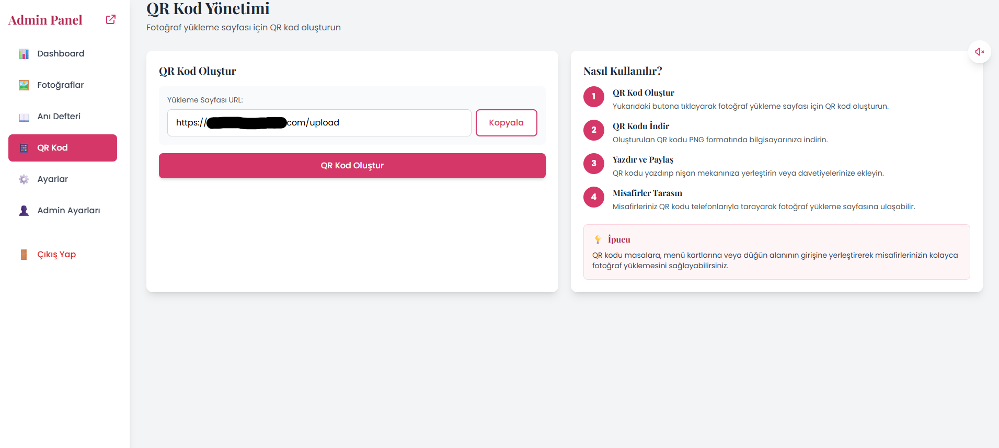
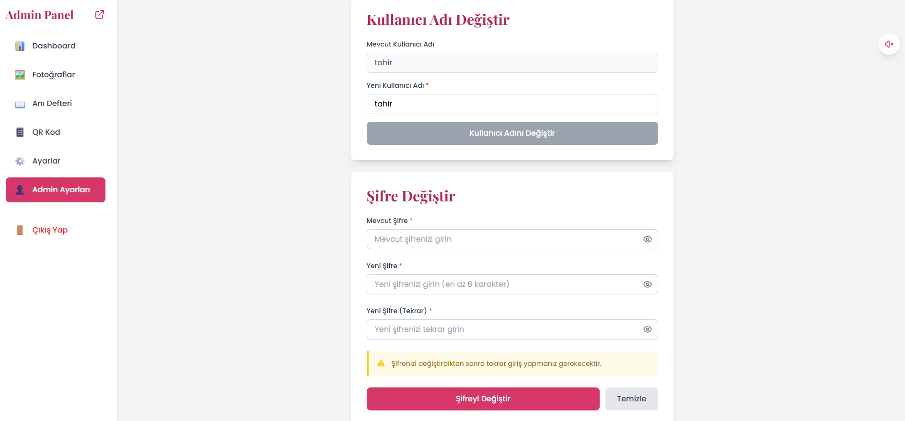

# Düğün/Nişan Fotoğraf Paylaşım Platformu 💒📸

Modern, kullanıcı dostu ve tamamen responsive bir düğün/nişan fotoğraf paylaşım ve anı defteri uygulaması.


## 📋 İçindekiler

- [Özellikler](#özellikler-)
- [Ekran Görüntüleri](#ekran-görüntüleri-)
- [Teknolojiler](#teknolojiler-)
- [Kurulum](#kurulum-)
- [Kullanım](#kullanım-)
- [Admin Paneli](#admin-paneli-)
- [Deployment](#deployment-)
- [Güvenlik](#güvenlik-)
- [Proje Yapısı](#proje-yapısı-)


## Özellikler ✨

- 📸 **Fotoğraf Galerisi** - Cloudinary entegrasyonu ile modern grid layout
- 📖 **Anı Defteri** - Misafirlerin anılarını ve iyi dileklerini paylaşabileceği özel sayfa
- 🎵 **Arka Plan Müziği** - Yumuşak ambient müzik ile ses kontrolü
- 🔐 **Admin Paneli** - Fotoğraf ve anı yönetimi için güvenli dashboard
- 📱 **Responsive Tasarım** - Tüm cihazlarda mükemmel görünüm
- 🎨 **Modern UI** - Güzel gradient arkaplanlar ve animasyonlar
- 🔒 **JWT Authentication** - Refresh token ile güvenli admin erişimi


## Ekran Görüntüleri 📸

### Ana Sayfa

Hoş geldiniz ekranı - Zarif tasarım ve kullanıcı dostu arayüz

### Fotoğraf Galerisi

Modern grid layout ile fotoğraf galerisi

### Fotoğraf Yükleme

Sürükle-bırak veya tıklayarak fotoğraf yükleme

### Anı Defteri

Misafirlerin anılarını paylaşabileceği özel sayfa

### Admin Girişi

Güvenli JWT tabanlı admin girişi

### Admin Dashboard

Kapsamlı yönetim paneli ve istatistikler

### Fotoğraf Yönetimi

Fotoğrafları görüntüleme ve silme

### Anı Yönetimi

Misafir anılarını yönetme ve moderasyon

### Ayarlar

Uygulama özelliklerini yapılandırma

### QR Kod

Kolay paylaşım için QR kod oluşturma

### Hesap Ayarları

Admin kullanıcı adı ve şifre yönetimi

## Teknolojiler 🛠️

### Frontend
- React 18 - Modern kullanıcı arayüzü
- Vite - Hızlı geliştirme ortamı
- Tailwind CSS - Utility-first CSS framework
- React Router DOM - Sayfa yönlendirme
- Axios - HTTP istekleri
- React Toastify - Bildirimler
- date-fns - Tarih işlemleri

### Backend
- Node.js - JavaScript runtime
- Express.js - Web framework
- MongoDB (Mongoose) - NoSQL veritabanı
- JWT Authentication - Güvenli kimlik doğrulama
- Cloudinary - Görsel hosting
- Bcrypt - Şifre hashleme

## Kurulum 🚀

### Gereksinimler
- Node.js (v16 veya üzeri)
- MongoDB Atlas hesabı
- Cloudinary hesabı

### Kurulum Adımları

1. **Projeyi klonlayın**
```bash
git clone <repository-url>
cd weddindPhotos
```

2. **Backend Kurulumu**
```bash
cd server
npm install
cp .env.example .env
# .env dosyasını kendi bilgilerinizle düzenleyin
```

3. **Frontend Kurulumu**
```bash
cd client
npm install
cp .env.example .env
# .env dosyasını API URL ve Cloudinary bilgilerinizle düzenleyin
```

### Ortam Değişkenleri

#### Server (.env)
```env
MONGODB_URI=mongodb_baglanti_stringi
JWT_SECRET=guclu_jwt_secret_anahtari
CLOUDINARY_CLOUD_NAME=cloudinary_cloud_adi
CLOUDINARY_API_KEY=cloudinary_api_key
CLOUDINARY_API_SECRET=cloudinary_api_secret
CLOUDINARY_UPLOAD_PRESET=upload_preset_adi
PORT=5000
ADMIN_USERNAME=admin
ADMIN_PASSWORD=guclu_sifre
```

#### Client (.env)
```env
VITE_API_URL=http://localhost:5000/api
VITE_CLOUDINARY_CLOUD_NAME=cloudinary_cloud_adi
VITE_CLOUDINARY_UPLOAD_PRESET=upload_preset_adi
```

### Uygulamayı Çalıştırma

1. **Backend'i Başlatın**
```bash
cd server
npm run dev
```

2. **Frontend'i Başlatın**
```bash
cd client
npm run dev
```

3. Tarayıcınızda http://localhost:3000 adresini açın

## Admin Paneli 👨‍💼

Admin paneline `/admin/login` adresinden erişebilirsiniz.

Varsayılan giriş bilgileri (⚠️ Mutlaka değiştirin!):
- Kullanıcı adı: `admin`
- Şifre: `admin123`

### Admin Özellikleri:
- Fotoğrafları görüntüleme ve silme
- Anıları yönetme ve moderasyon
- Ayarları yapılandırma (yükleme, filtreler, vb.)
- Kullanıcı adı ve şifre değiştirme
- İstatistikleri görüntüleme
- QR kod oluşturma

## Deployment 🌐

### Frontend (Vercel)
```bash
cd client
npm run build
vercel deploy
```

### Backend (Render/Railway)
- GitHub repository'nizi bağlayın
- Ortam değişkenlerini ayarlayın
- Deploy edin

## Güvenlik 🔒

⚠️ **ÖNEMLİ**: Repository'yi public yapmadan önce:
- ✅ `.env` dosyaları `.gitignore` içinde
- ✅ Kodda sabit kodlanmış kimlik bilgisi yok
- ✅ `.env.example` dosyaları sağlandı
- ✅ Varsayılan admin şifresi değiştirildi
- ✅ Production'da güçlü JWT secret kullanıldı

## Özellikler Detaylı 📋

### Fotoğraf Yükleme
- Sürükle-bırak veya tıklayarak yükleme
- Cloudinary'ye direkt yükleme
- Admin tarafından açılıp kapatılabilir
- Otomatik optimizasyon

### Anı Defteri
- Misafirler anılarını paylaşabilir
- Admin moderasyonu
- Tarihe göre sıralama
- Toplu silme seçeneği

### Müzik Çalar
- Otomatik çalan arka plan müziği
- Sessize alma kontrolü
- Kesintisiz döngü
- Tarayıcı autoplay desteği

## Katkıda Bulunma 🤝

Katkılar memnuniyetle karşılanır! Lütfen Pull Request göndermekten çekinmeyin.

## Lisans 📄

Bu proje MIT Lisansı altında lisanslanmıştır.

## Destek 💬

Destek için lütfen GitHub repository'de issue açın.

## Proje Yapısı 📁

```
weddindPhotos/
├── client/                 # Frontend (React + Vite)
│   ├── public/            # Statik dosyalar
│   │   └── background-music.mp3
│   ├── src/
│   │   ├── components/    # Yeniden kullanılabilir bileşenler
│   │   │   ├── Navbar.jsx
│   │   │   ├── PhotoGrid.jsx
│   │   │   ├── MusicPlayer.jsx
│   │   │   └── ...
│   │   ├── pages/         # Sayfa bileşenleri
│   │   │   ├── HomePage.jsx
│   │   │   ├── GalleryPage.jsx
│   │   │   ├── UploadPage.jsx
│   │   │   ├── MemoryBookPage.jsx
│   │   │   └── admin/
│   │   │       ├── AdminLogin.jsx
│   │   │       ├── AdminDashboard.jsx
│   │   │       ├── AdminPhotos.jsx
│   │   │       ├── AdminMemories.jsx
│   │   │       ├── AdminSettings.jsx
│   │   │       ├── AdminQR.jsx
│   │   │       └── AdminAccount.jsx
│   │   ├── contexts/      # React Context API
│   │   │   └── AuthContext.jsx
│   │   ├── App.jsx        # Ana uygulama bileşeni
│   │   └── main.jsx       # Giriş noktası
│   └── package.json
│
├── server/                # Backend (Node.js + Express)
│   ├── config/           # Yapılandırma dosyaları
│   │   ├── db.js         # MongoDB bağlantısı
│   │   └── cloudinary.js # Cloudinary yapılandırması
│   ├── models/           # Mongoose modelleri
│   │   ├── Photo.js
│   │   ├── Memory.js
│   │   ├── Admin.js
│   │   └── Settings.js
│   ├── routes/           # API route'ları
│   │   ├── photos.js
│   │   ├── memories.js
│   │   ├── admin.js
│   │   └── settings.js
│   ├── middleware/       # Express middleware
│   │   └── auth.js       # JWT doğrulama
│   ├── server.js         # Ana sunucu dosyası
│   └── package.json
│
├── screenshots/          # Ekran görüntüleri
└── README.md            # Proje dokümantasyonu
```

---

